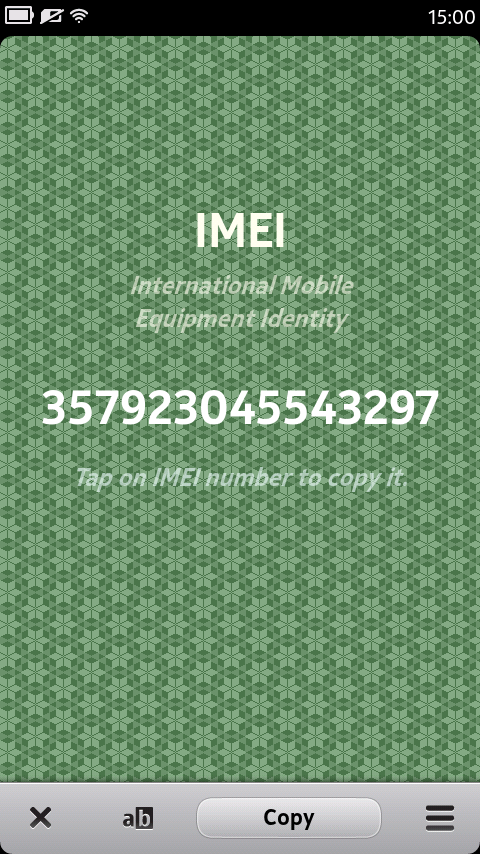
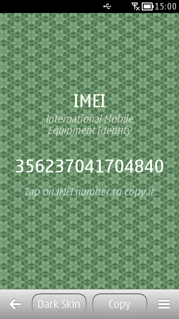

# IMEI Reader

An old and obsolete MeeGo Harmattan project.

IMEI Reader is a Qt powered application for Symbian and MeeGo mobile platform.

It demonstrates how Qt cross platform software toolkit could be used on both Symbian and MeeGo mobile platforms.

## Features

This application will read [International Mobile Equipment Identity (IMEI)](https://en.wikipedia.org/wiki/International_Mobile_Equipment_Identit) from your mobile device. Furthermore, it can copy the IMEI number to clipboard for further use.

### Screenshots

## Credits

Special thanks to [Squidfingers](http://www.squidfingers.com/patterns) for those nice tiled backgrounds!

## (Obsolete) Availability in Nokia Store

Check out ImeiReader for MeeGo in Nokia Store.

- Desktop web browser: http://bit.ly/Mi9xyE | http://store.nokia.com/content/294591

- Mobile browser: http://bit.ly/S3jOO9 | http://store.ovi.mobi/content/294591

Check out ImeiReader for Symbian in Nokia Store.

- Desktop web browser: http://bit.ly/MZ4L96 | http://store.nokia.com/content/294594

- Mobile browser: http://bit.ly/L8938e | http://store.ovi.mobi/content/294594